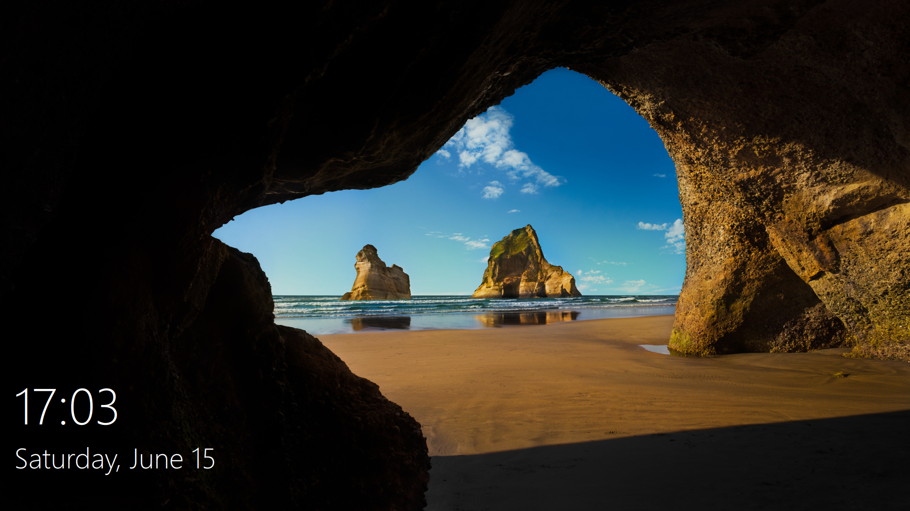

work in progress! 

things left to do:

- [x] greeting screen with only clock
- [ ] change default user icon
- [x] fix user images for bottom left user list
- [ ] maybe networking icons

env -i HOME=$HOME DISPLAY=$DISPLAY XAUTHORITY=$XAUTHORITY sddm-greeter-qt6 --test-mode --theme /path/to/directory

